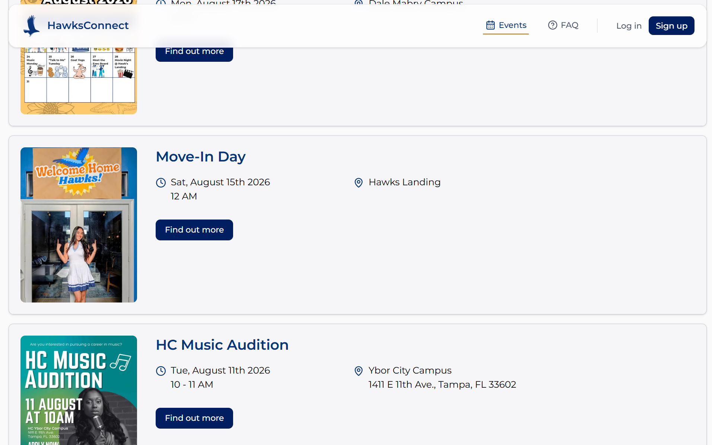
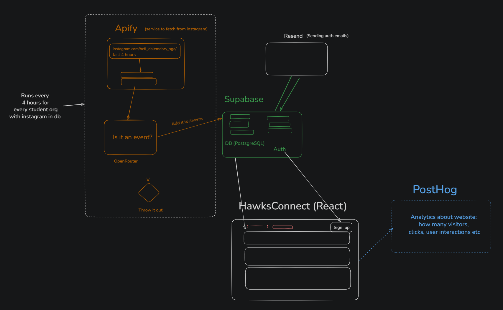

# HawksConnect

**Every campus event and club meetup in one place for Hillsborough College students.**

Live at **[hawksconnect.com](https://hawksconnect.com)**

---

# Part 1: What this is and why it exists

## The problem

Hillsborough College's student organizations all announce events the same way: a flyer posted to
their own Instagram account. That reaches the people already following that club, and nobody else.
A student asking *"what is happening on my campus this week?"* would have to follow thirty accounts
to find out.

So students miss events they would have attended, and clubs get low turnout despite doing all the
work of planning them. New and commuter students, the ones who most need a way in, are hit hardest.
Six campuses fragment the audience further: an event at Ybor is invisible to a student at Brandon.

## What HawksConnect does

HawksConnect collects every student organization event into one browsable place, automatically.

**Clubs don't have to do anything new.** No portal, no form, no second place to remember to post.
They keep posting flyers to Instagram exactly as they do now, and HawksConnect picks them up.
Anything that asked clubs to change their workflow would be abandoned within a semester; this works
whether or not a club has ever heard of us.

## How it works, in plain terms

1. Every four hours, HawksConnect checks the Instagram account of each student organization it
   knows about for new posts.
2. Each new post is read by an AI model, including the text printed on the flyer image itself,
   which is usually where the date, time, and room number actually live.
3. The model decides whether the post is announcing a real event. Team photos, congratulations, and
   general promo are discarded.
4. If it is an event, the model pulls out the details (name, description, date, start and end time,
   campus, and location) and the event appears on the site.

A single flyer sometimes advertises several events at once, like a "week of activities" schedule
listing something different each day. Those are split into separate events, so each one shows up
under its own date rather than being buried in one entry.

## What's live today

- **Events page**: every upcoming event, filterable by campus and by upcoming/past, with search by
  event title or club name.
- **Event detail pages**: full description, date and time, campus and room, the organizing club,
  and a link back to the club's original Instagram post so students can verify the source.
- **Add to Calendar**: Google Calendar, Apple Calendar, Microsoft 365, or a downloadable `.ics`.
- **Clubs directory**: every organization gets a page listing what it has posted. Live at `/clubs`,
  though the nav link is hidden for now while the page is reworked.
- **Accounts**: sign up with a Hawkmail address to RSVP to events and follow clubs.

Some of this is newer than the rest. **RSVP, following clubs, and login/signup work but are not yet
fully stable.** They're the areas most likely to have rough edges, and good places to contribute.



## What's next

**Front end**

- Collapsible student organization list on the clubs page
- Show each club's president and vice president on its page
- Grid / flyer view toggle on the events page, so the page can be browsed visually
- Google sign-in alongside Hawkmail email/password
- Harden RSVP, follow, and auth flows

**Back end**

- Improve classification accuracy. The current pain point is teaching the model to reliably tell a
  real event apart from general club promo
- Fix flyer matching for multi-event roundup posts, where the wrong image is sometimes attached to
  an event
- Expand beyond Instagram to Discord servers and other sources

## Who's behind it

HawksConnect is an independent student-built project, created by
[Egor Kharitonov](https://www.kharitonovegor.com/) and
[Hitha Reddy Pothula](https://www.linkedin.com/in/hitha-reddy-pothula/), both HC alumni.

It is **not officially affiliated with Hillsborough College**, though we hope to partner with the
college as the platform grows. It is free for all students, and always will be.

---

# Part 2: Contributing

New contributors are welcome, including if this is your first time working on a real codebase. This
section assumes nothing is installed on your computer yet.

## Architecture



Reading the diagram from left to right:

- A scheduled job runs **every four hours** for every student organization that has an Instagram URL
  stored in the database. It is triggered by calling `/api/fetch`; the schedule itself is configured
  outside this repo, so there is no cron file in the codebase.
- **Apify** is given that Instagram URL and a time window, and returns the account's recent posts as
  JSON.
- Each post is sent through **OpenRouter** to an AI model, which answers one question: *is this an
  event?* If no, the post is thrown out. If yes, a second call extracts the structured details.
- Events are written to **Supabase** (PostgreSQL), which also handles user accounts and auth.
- **Resend** delivers auth emails (confirmations, password resets) on Supabase's behalf.
- The **Next.js / React** front end reads events straight from Supabase and renders the site.

## Tech stack

| Layer | What we use | Notes |
|---|---|---|
| Framework | **Next.js 16** (App Router) + **React 19** | Pages live in `app/`; interactive ones are `"use client"` |
| Language | **TypeScript** | `any` is not allowed, see conventions below |
| Styling | **Tailwind CSS v4** + **shadcn/ui** | Primitives in `components/ui/`, added via the shadcn CLI |
| Icons | **lucide-react** | |
| Database & auth | **Supabase** (PostgreSQL) | Queried directly from the browser client |
| Email | **Resend** | Wired into Supabase as custom SMTP |
| Instagram scraping | **Apify** | Instagram post scraper actor |
| AI classification | **OpenRouter** | One API for GPT, Claude, and others |
| Analytics | **PostHog** | |
| Hosting | **Vercel** | |

## Step 1: Check whether you have Node.js

The project runs on Node.js. You need **Node 20.9 or newer** (we develop on Node 24).

**Open a terminal:**

- **Windows**: press the Windows key, type `powershell`, press Enter. (Git Bash also works.)
- **macOS**: press Cmd+Space, type `terminal`, press Enter.
- **Linux**: Ctrl+Alt+T in most desktop environments.

**Type this and press Enter:**

```bash
node -v
```

**If you see a version number** like `v24.14.0`, you have Node. Check that the first number is 20 or
higher, then move on to step 2.

**If you see** `command not found`, `'node' is not recognized`, or a version older than 20, install
Node:

- Go to **[nodejs.org](https://nodejs.org)** and download the **LTS** version for your operating
  system.
- Run the installer and accept the defaults.
- **Close your terminal completely and open a new one.** This trips up almost everyone. A terminal
  opened before installing won't know Node exists.
- Run `node -v` again to confirm.

You also need **npm**, which comes bundled with Node. Confirm with:

```bash
npm -v
```

## Step 2: Check whether you have Git

```bash
git --version
```

If that errors, install it from **[git-scm.com](https://git-scm.com/downloads)** (the defaults are
fine), then reopen your terminal.

## Step 3: Get the code

Navigate to wherever you keep projects and clone the repository:

```bash
cd Documents
git clone https://github.com/kharitonov-egor/hawksconnect.git
cd hawksconnect
```

`cd hawksconnect` moves you into the folder that was just created. Every command from here on
assumes you are inside it.

Now install the project's dependencies:

```bash
npm install
```

This reads `package.json` and downloads everything into a `node_modules/` folder. It takes a minute
or two the first time and prints a lot of output, which is normal. Warnings are fine; errors are
not.

## Step 4: Set up your credentials

The app needs API keys to reach the database and the other services. These are **not** in the
repository, and never should be.

Copy the template:

```bash
# macOS / Linux / Git Bash
cp .env.example .env.local

# Windows PowerShell
Copy-Item .env.example .env.local
```

Then open `.env.local` in your editor and fill in the values:

| Variable | What it's for | Where it comes from |
|---|---|---|
| `NEXT_PUBLIC_SUPABASE_URL` | Address of the database | Ask Egor, or Supabase → Project Settings → API |
| `NEXT_PUBLIC_SUPABASE_PUBLISHABLE_KEY` | Public read key, safe in the browser | Same place |
| `SUPABASE_SECRET_KEY` | Full-access server key | Ask Egor (**only needed for back-end work**) |
| `APIFY_KEY` | Instagram scraping | Ask Egor (only needed for back-end work) |
| `OPENROUTER_API_KEY` | AI classification | Ask Egor (only needed for back-end work) |
| `NEXT_PUBLIC_POSTHOG_PROJECT_TOKEN` | Analytics | Optional locally; leave blank |
| `NEXT_PUBLIC_POSTHOG_HOST` | Analytics | Already filled in by the template |

**If you're working on the front end, you only need the first two.** Everything on the site reads
from the database with the public key, so you can browse events, clubs, and detail pages without any
of the back-end keys.

**To get credentials, message [Egor](https://www.kharitonovegor.com/)** and say what you plan to work
on. You'll be sent the values, and invited to the Supabase project and the GitHub repo if you need
write access.

Two rules about this file:

- **Never commit `.env.local`.** It's already in `.gitignore`; leave it that way.
- Anything starting with `NEXT_PUBLIC_` is visible to anyone who opens the site in a browser. Keys
  without that prefix are server-only and must never be given the prefix.

## Step 5: Run it

```bash
npm run dev
```

Wait for `Ready`, then open **[http://localhost:3000](http://localhost:3000)**. You should see the
landing page. Edit any file under `app/`, save it, and the browser updates on its own.

To stop the server, press **Ctrl+C** in that terminal.

**If something goes wrong:**

| Symptom | Fix |
|---|---|
| `command not found: npm` | Node isn't installed, or you didn't reopen your terminal after installing it |
| `Cannot find module ...` | You skipped `npm install` |
| Port 3000 already in use | Something else is running on it; stop it, or run `npm run dev -- -p 3001` |
| Site loads but no events appear | Your Supabase values in `.env.local` are missing or wrong |

## Step 6: Make a change and open a pull request

Nothing goes straight into `main`. Your work lives on its own branch, and gets merged through a
pull request (a PR) once someone has looked at it. If you've never done this, here is the whole
loop.

**1. Start from an up-to-date `main`:**

```bash
git checkout main
git pull
```

**2. Create a branch for your work.** Name it after what you're doing, with `fix/` for bugs and
`feature/` for new things:

```bash
git checkout -b fix/rsvp-double-click
```

You're now on that branch. `git status` will tell you which branch you're on at any time.

**3. Make your change**, then check it before committing:

```bash
npx tsc --noEmit    # type check, must be clean
npm run lint        # eslint
```

Fix anything these report. A PR that fails them will be sent back.

**4. Stage and commit.** `git status` shows what you touched:

```bash
git status
git add .
git commit -m "Stop RSVP from firing twice on a fast double click"
```

`git add .` stages every changed file; `git add app/events/page.tsx` stages just one. Write the
commit message as a sentence about what changed and why, not "update" or "fix stuff".

**5. Push the branch to GitHub:**

```bash
git push -u origin fix/rsvp-double-click
```

The `-u origin <branch>` part is only needed the first time you push a new branch. After that,
plain `git push` is enough.

If you get a permission error here, you don't have write access to the repo yet. Either ask Egor
for access, or use the fork workflow: click **Fork** at the top of the GitHub page, clone your fork
instead, and push there.

**6. Open the pull request.** Go to
[the repo on GitHub](https://github.com/kharitonov-egor/hawksconnect). A yellow banner appears with
a **Compare & pull request** button; click it. If you don't see the banner, go to **Pull requests**
→ **New pull request**, set base to `main` and compare to your branch.

**7. Describe it and submit.** Give it a clear title, say what changed and why in the description,
and **attach a screenshot for any visual change** (drag the image straight into the text box). Then
click **Create pull request**.

**8. Respond to review.** If someone asks for changes, make them on the same branch and push again.
The PR updates itself, no need to open a new one.

## Project layout

```
app/
  page.tsx              Landing page
  main.tsx              Landing hero
  NavBar.tsx            Shared nav (desktop links + mobile menu)
  Footer.tsx            Shared footer
  events/
    page.tsx            Events list with campus/time filters and search
    [id]/page.tsx       Event detail page, keyed by slug
    event.tsx           Event card
    RSVPButton.tsx      RSVP toggle
    AddToCalendarButton.tsx
    InstagramLinkButton.tsx
  clubs/
    page.tsx            Clubs directory
    [id]/page.tsx       Club detail plus that club's events
  my-events/page.tsx    Events the signed-in student RSVP'd to
  login/ signup/ faq/   Auth pages and FAQ
  api/fetch/route.ts    Triggers the scrape-and-classify pipeline
  lib/                  Supabase clients, Apify, OpenRouter, helpers
components/ui/          shadcn primitives
docs/                   Architecture diagram and images
```

## Data model

Four tables in Supabase:

- **`events`**: one row per event. Key columns are `name`, `description`, `startTime`, `endTime`,
  `campus`, `location`, `organizer` (foreign key to `organizers`), `flyerURL`, `instaShortURL` (the
  source Instagram post), and `slug` (the unique key detail-page URLs use).
- **`organizers`**: student organizations, including their `socialLinks.instagram` URL, which is
  what the pipeline scrapes.
- **`rsvps`**: links a user to an event.
- **`club_follows`**: links a user to an organization.

One Instagram post can produce several events, so multiple rows may share an `instaShortURL`. That's
why `slug` exists: the first event off a post gets the Instagram shortcode, and the rest get
`shortcode-2`, `shortcode-3`, and so on.

## Conventions

- **No `any`.** Use `unknown` and narrow it, generics, or a proper union type. This is enforced in
  review, and existing `any`s should be cleaned up when you touch that code.
- **Comments are rare.** Prefer clear names. Comment only non-obvious *why*, never *what*.
- **Tailwind for styling**, shadcn for primitives. Brand colors are hardcoded hex: `#001E60` and
  `#06357A` (navy), `#B99C5F` (gold).
- **Analytics:** track meaningful actions with `posthog.capture("event_name", { ... })`, following the
  existing snake_case naming.
- Campus keys are stored as short strings (`dale_mabry`, `ybor`, and so on) and are **not perfectly
  consistent** in the data. Always render them through `campusLabel()` in `app/lib/campus.ts` rather
  than writing another lookup table.

## Good places to start

Everything on the roadmap is filed as a GitHub issue, with context and pointers to the right files:

- **[Good first issues](https://github.com/kharitonov-egor/hawksconnect/issues?q=is%3Aissue+is%3Aopen+label%3A%22good+first+issue%22)**
  are the ones to start with. They're self-contained and touch a small number of files.
- **[All open issues](https://github.com/kharitonov-egor/hawksconnect/issues)** if you want the full
  picture, filterable by the `frontend` and `backend` labels.

**Comment on an issue before you start working on it** so two people don't build the same thing.

Back-end issues (classification accuracy, flyer matching) are higher impact but need the full set of
API keys, and running the pipeline spends real credit, so reach out before starting one.

## Questions

Ask [Egor](https://www.kharitonovegor.com/). Anything unclear in this README is a bug in the README;
say so and it will be fixed.
